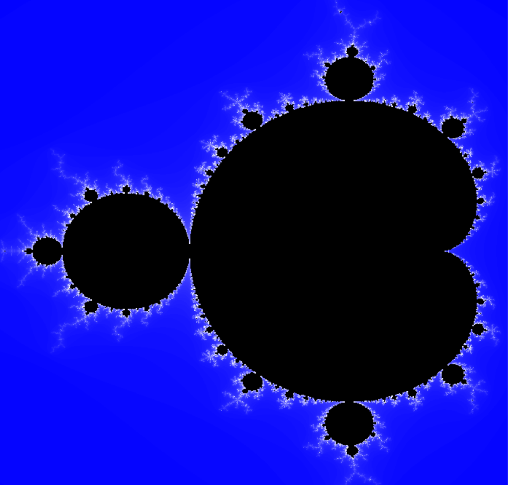

This repository contains sources that can be used to generate an image of the Mandelbrot set using both cpu and gpu. The Mandelbrot set is a very elegant complex fractal. Here is an example:



The GPU implemented in c++ requires the SDL to be installed, i.e.

```sudo apt-get install libsdl2-2.0 libsdl2-dev```
